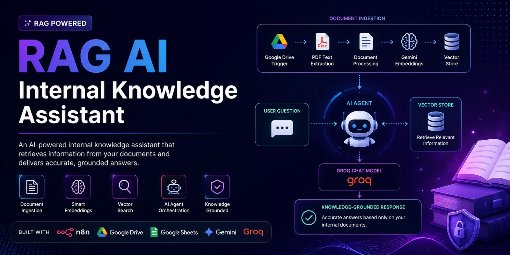
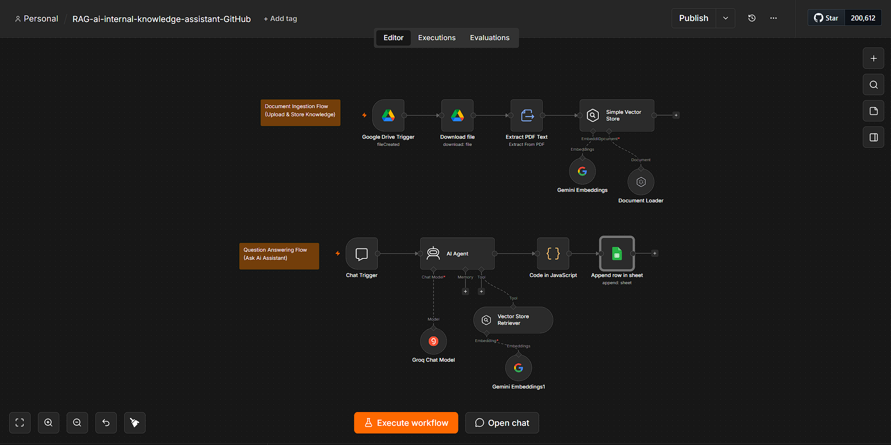

# RAG AI Internal Knowledge Assistant

**An AI-powered internal knowledge assistant built with Retrieval-Augmented Generation (RAG) and n8n to provide grounded answers from company documents.**

## 📌 Overview

The **RAG AI Internal Knowledge Assistant** transforms internal company documents into an interactive AI-powered knowledge base.

Users can ask questions in natural language, and the system retrieves relevant information from the indexed documents before generating an answer using the retrieved context.

Instead of relying only on the AI model's general knowledge, the assistant is designed to **ground its responses in the organization's internal documentation**, helping reduce unsupported or hallucinated answers.

## 🎯 Problem Statement

Organizations often store important information across multiple documents, including:

- HR policies
- Employee handbooks
- Leave policies
- Benefits information
- Security guidelines
- Work-from-home policies
- Frequently asked questions

Finding specific information manually can be time-consuming.

This project provides a centralized AI assistant that allows users to ask questions and retrieve relevant information from the organization's internal knowledge base.

## 💡 Solution

The system uses a **Retrieval-Augmented Generation (RAG)** architecture.

When a user submits a question, the workflow:

1. Receives the user's query.
2. Searches the vector knowledge base.
3. Retrieves the most relevant document chunks.
4. Passes the retrieved context to the AI agent.
5. Generates a response grounded in the retrieved information.
6. Returns the final answer to the user.

## 🏗️ Architecture

| Phase | Component | Description |
|---|---|---|
| Data Layer | Internal Documents | Source HR and company policy documents |
| Processing | Document Ingestion | Loads documents into the pipeline |
| Processing | Text Extraction | Extracts text from documents |
| Processing | Text Chunking | Splits documents into smaller chunks |
| Embedding | Embeddings Generation | Converts text into vector representations |
| Storage | Vector Store | Stores embeddings for semantic retrieval |
| Query | User Question | Receives the user's question |
| Retrieval | Semantic Retrieval | Finds relevant document chunks |
| Context | Relevant Context | Provides retrieved knowledge to the AI |
| Generation | AI Agent | Processes the retrieved context |
| Output | Grounded Answer | Generates the final response |

## 📚 Knowledge Base

The RAG system uses **7 internal company documents**:

| # | Document |
|---:|---|
| 1 | Code of Conduct |
| 2 | Leave Policy |
| 3 | IT & Information Security Policy |
| 4 | Employee Benefits Policy |
| 5 | Work From Home (WFH) Policy |
| 6 | Employee Handbook |
| 7 | HR FAQs |

These documents cover employee policies, leave rules, benefits, security requirements, workplace conduct, remote work, and HR-related information.

## ✨ Key Features

| Feature | Description |
|---|---|
| 📄 Document Ingestion | Processes internal company documents |
| 🔍 Semantic Search | Retrieves relevant information using vector similarity |
| 🧠 RAG Architecture | Combines retrieval with AI generation |
| 🤖 AI Agent | Generates responses using retrieved context |
| 📚 Knowledge Base | Centralized source of company information |
| 🎯 Grounded Answers | Bases responses on retrieved documentation |
| 🛡️ Hallucination Reduction | Helps reduce unsupported AI responses |
| ⚡ Automated Workflow | Orchestrated using n8n |

## ⚙️ Workflow

### 1. Document Ingestion

Internal company documents are provided as the knowledge source for the assistant.

### 2. Text Processing

Document content is extracted and divided into smaller chunks to make retrieval more effective.

### 3. Embedding Generation

The processed text chunks are converted into vector representations.

### 4. Vector Storage

The embeddings are stored in a vector store, allowing semantic similarity searches.

### 5. Query Processing

When a user asks a question, the query is processed and used to search the knowledge base.

### 6. Semantic Retrieval

The system retrieves the most relevant document chunks related to the user's question.

### 7. AI Response Generation

The retrieved context is passed to the AI agent, which generates a response based on the available information.

## 🛠️ Tech Stack

| Technology | Purpose |
|---|---|
| **n8n** | Workflow automation and orchestration |
| **Google Drive** | Document storage and monitoring |
| **Google Gemini** | Embeddings / AI processing |
| **Groq** | AI chat model |
| **Vector Store** | Semantic document retrieval |
| **RAG** | Retrieval-Augmented Generation architecture |
| **JSON** | Workflow configuration and data exchange |

## 🧪 Evaluation

The RAG assistant was evaluated using a dedicated test dataset created from the 7 knowledge-base documents.

### Test Dataset

| Metric | Result |
|---|---:|
| Questions Tested | 20 |
| Pass Cases | 15 |
| Fail Cases | 5 |
| Documents Evaluated | 7 |

The questions were intentionally mixed to test whether the system can distinguish between information supported by the knowledge base and incorrect statements.

### Evaluation Criteria

| Criterion | Description |
|---|---|
| Retrieval Accuracy | Retrieves relevant information from the knowledge base |
| Answer Correctness | Generates answers consistent with source documents |
| Grounded Responses | Uses retrieved context instead of unsupported information |
| Pass/Fail Classification | Distinguishes supported and contradictory statements |
| Hallucination Control | Reduces unsupported or fabricated responses |

### 📊 Evaluation Dataset

The complete evaluation dataset is available here:

Detailed evaluation methodology:

## 📈 Evaluation Metrics

The evaluation framework supports the following metrics:

| Metric | Purpose |
|---|---|
| **Accuracy** | Measures the percentage of correctly classified test cases |
| **Precision** | Measures correctness of identified Pass cases |
| **Recall** | Measures how many expected Pass cases were identified |
| **F1 Score** | Combines precision and recall into a single metric |

> Final performance metrics should be calculated from the actual RAG test results rather than estimated values.

## 🖼️ Workflow

The complete n8n workflow demonstrates the document ingestion, processing, embedding, retrieval, and AI response-generation pipeline.

## 📂 Repository Structure

| File | Purpose |
|---|---|
| `README.md` | Project documentation |
| `Evaluation.md` | Evaluation methodology and criteria |
| `rag-evaluation-test-dataset.xlsx` | 20-question evaluation dataset |
| `workflow.json` | n8n workflow configuration |
| `Banner.jpeg` | Project banner |
| `workflow-screenshot.png` | Workflow screenshot |

## 🔐 Security & Data Handling

API keys, authentication tokens, credentials, and other sensitive configuration values should not be committed to the repository.

The workflow should use secure credential management or environment variables for sensitive configuration.

## 🚀 Potential Use Cases

The architecture can be adapted for:

- Internal HR assistants
- Employee support systems
- IT helpdesk assistants
- Company policy assistants
- Customer support knowledge bases
- Product documentation assistants
- Internal SOP assistants
- Enterprise knowledge management systems

## 🎓 Skills Demonstrated

This project demonstrates practical experience with:

- Retrieval-Augmented Generation (RAG)
- AI Agent development
- Vector embeddings
- Semantic search
- Vector stores
- Document processing
- Text chunking
- Prompt engineering
- n8n workflow automation
- Knowledge-base design
- RAG evaluation
- Hallucination reduction

## 🔮 Future Improvements

Potential improvements include:

- Source citations in every generated answer
- Hybrid keyword and semantic retrieval
- Retrieval re-ranking
- Conversation memory
- User authentication and access control
- Document version tracking
- Automated evaluation dashboards
- Larger evaluation datasets
- User feedback-based retrieval improvement
- Production monitoring and analytics

## 📌 Conclusion

The **RAG AI Internal Knowledge Assistant** demonstrates how internal company documents can be transformed into an interactive AI knowledge system.

By combining **RAG, vector retrieval, embeddings, AI agents, and n8n workflow automation**, the project provides a practical approach to building AI assistants that can answer questions using organization-specific knowledge while reducing reliance on unsupported model-generated information.

